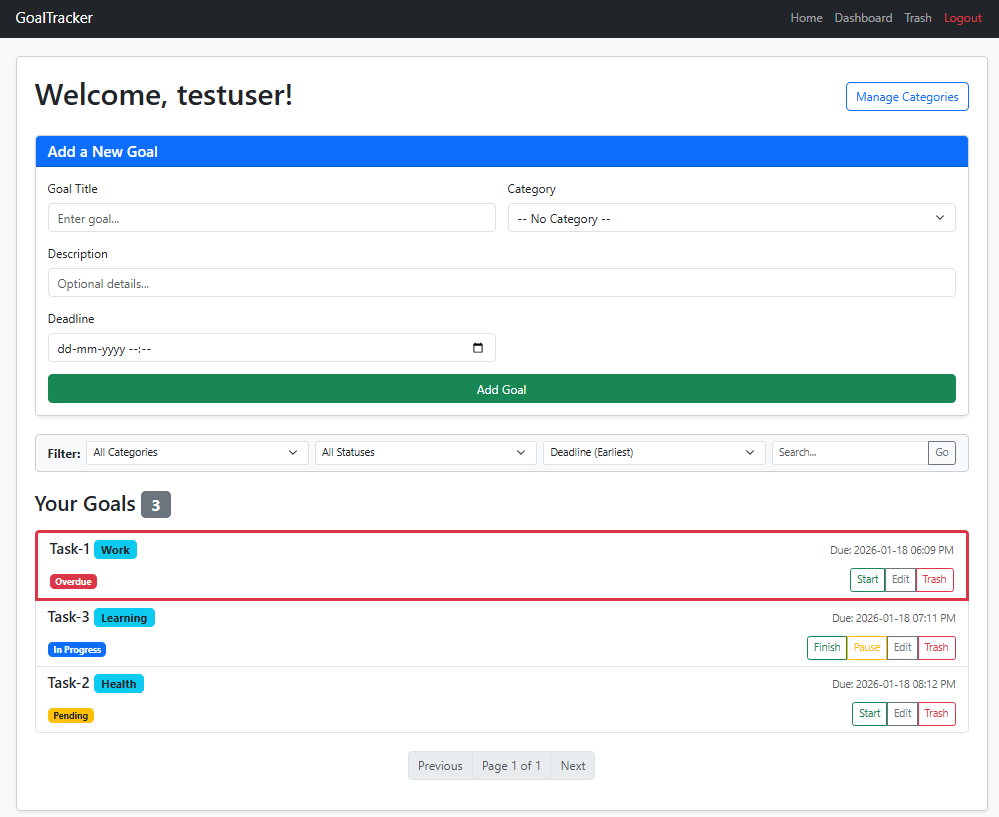
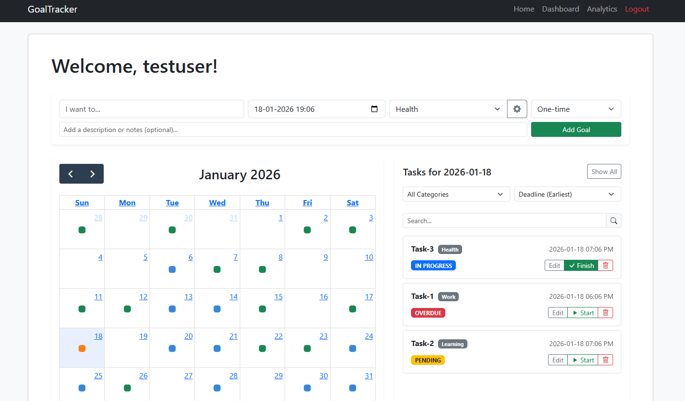

# GoalTracker v2.0

**A journey from a monolithic Flask app to a modular, API-driven productivity engine.**

GoalTracker v2.0 is the result of a complete codebase overhaul. The original project (v1) was a standard server-side rendered application. V2 focuses on **modernizing the architecture**: decoupling the frontend, implementing a REST API, and introducing Separation of Concerns (SoC) via Flask Blueprints.

🔗 **Live Demo:** [INSERT YOUR RENDER LINK HERE]

---

## 🛠️ The Architecture Evolution

This project documents my transition from writing "script-like" web apps to building scalable software systems.

### 1. Refactoring & Modularization
* **V1 (Monolithic):** The entire application logic lived in a single `app.py` file, making it hard to debug and extend.
* **V2 (Modular):** I broke the application into **Flask Blueprints** (`auth`, `main`, `api`). This separates authentication, routing, and data logic into distinct modules, enforcing clean Separation of Concerns.

### 2. Frontend Modernization (The "No-Reload" Shift)
* **V1 (Static):** Relied heavily on Jinja2 templating. Every interaction (adding a task, deleting) required a full page reload.
* **V2 (Dynamic):** I introduced **JavaScript** and **Alpine.js** to handle state on the client side.
    * **API-First:** The backend now exposes JSON endpoints (`/api/goals`, `/api/stats`).
    * **Reactive UI:** Interactions are handled via `fetch()` requests, allowing the UI to update instantly without refreshing the page.

### 3. UI/UX Overhaul
* **Calendar Integration:** Replaced the static list view with **FullCalendar.js**, creating a heatmap visualization of task density.
* **Task Management:** Designed a new "Quick Add" flow, task searching, and template-based creation.
* **Analytics:** Added a dedicated dashboard using Chart.js to visualize completion momentum.

---

## 🆚 Visual Comparison

| **Legacy (v1)** | **Refactored (v2)** |
| :--- | :--- |
| **Monolithic Structure** (Single file) | **Modular Blueprints** (Scalable architecture) |
| **Server-Side Rendering** (Jinja2) | **Client-Side Reactivity** (Alpine.js + APIs) |
| **Full Page Reloads** | **Async JSON Updates** |
| **Basic Form UI** | **Interactive Calendar & Dashboard** |

### **The Legacy Interface (v1)**
*Basic CRUD with full reloads.*


### **The New Dashboard (v2)**
*Dynamic, API-driven interface with Calendar and Analytics.*


---

## ✨ New System Features

### 1. Recurrence Logic Engine
I moved beyond simple CRUD to implement a **Recurring Pattern** system.
* **Logic:** Instead of just duplicating tasks, the backend uses a factory pattern. When a parent task (e.g., "Daily Standup") is marked complete, the engine calculates the next occurrence based on the frequency (Daily/Weekly) and spawns a new instance automatically.

### 2. RAG-Based AI Helper
I integrated a helper chat using **Google Gemini**.
* **Retrieval Augmented Generation (RAG):** Instead of a generic chatbot, I implemented a system that pulls the *current goal's context* (Title, Description, Status, Deadline).
* **The Flow:** The app packages this data into a system prompt, allowing the AI to give specific advice relevant to that exact task.

### 3. Analytics Dashboard
Built a data visualization layer to track user productivity, calculating "Win Rates" and visualizing activity over the last 7 days.

---

## 💻 Tech Stack

**Backend**
* **Python 3 / Flask:** Core framework (Refactored into Blueprints).
* **SQLAlchemy:** ORM for database management.
* **REST API:** Custom endpoints serving JSON to the frontend.

**Frontend**
* **Alpine.js:** For lightweight, reactive state management.
* **JavaScript (ES6):** Custom logic for dynamic DOM manipulation.
* **Bootstrap 5:** Responsive UI components.
* **FullCalendar.js:** Event scheduling and visualization.
* **Chart.js:** Analytics rendering.

---

## 🚀 How to Run Locally

1.  **Clone the repository**
    ```bash
    git clone [https://github.com/harsh-verma-27/goal-tracker](https://github.com/harsh-verma-27/goal-tracker)
    cd goal-tracker
    ```

2.  **Install Dependencies**
    ```bash
    pip install -r requirements.txt
    ```

3.  **Set up Environment Variables**
    Create a `.env` file in the root directory:
    ```ini
    SECRET_KEY=your_secret_key
    GEMINI_API_KEY=your_google_ai_key
    DATABASE_URL=postgresql://... #Post your PostgreSQL database url here!
    ```

4.  **Seed the Database**
    Run the custom seed script to reset the DB and generate sample data.
    ```bash
    python seed.py
    ```

5.  **Run the App**
    ```bash
    python app.py
    ```

---

**Author:** Harsh Verma